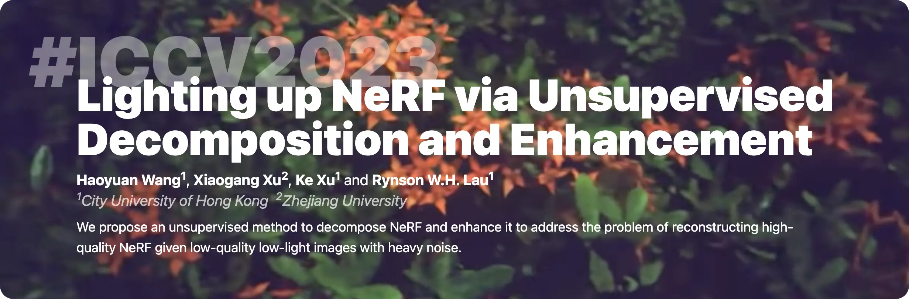

<div align="center">
  <a href="https://whyy.site/paper/llnerf">
    
  </a>

  [`🌐 Website`](https://whyy.site/paper/llnerf) &nbsp;&centerdot;&nbsp; [`📃 Paper`](https://arxiv.org/abs/2307.10664) &nbsp;&centerdot;&nbsp; [`🗃️ Dataset`](https://drive.google.com/drive/folders/1h-u8DkvuaIvcHZihYIWcqwpURiM32_u3?usp=sharing)
</div>

**Abstract:** Neural Radiance Field (NeRF) is a promising approach for synthesizing novel views, given a set of images and the corresponding camera poses of a scene. However, images photographed from a low-light scene can hardly be used to train a NeRF model to produce high-quality results, due to their low pixel intensities, heavy noise, and color distortion. Combining existing low-light image enhancement methods with NeRF methods also does not work well due to the view inconsistency caused by the individual 2D enhancement process. In this paper, we propose a novel approach, called Low-Light NeRF (or LLNeRF), to enhance the scene representation and synthesize normal-light novel views directly from sRGB low-light images in an unsupervised manner. The core of our approach is a decomposition of radiance field learning, which allows us to enhance the illumination, reduce noise and correct the distorted colors jointly with the NeRF optimization process. Our method is able to produce novel view images with proper lighting and vivid colors and details, given a collection of camera-finished low dynamic range (8-bits/channel) images from a low-light scene. Experiments demonstrate that our method outperforms existing low-light enhancement methods and NeRF methods.

## 📻 News

- `[2023/07/21]` &nbsp;&centerdot;&nbsp; Code released ! 🔥🔥🔥
- `[2023/07/17]` &nbsp;&centerdot;&nbsp; Paper accepted by ICCV 2023.

## ⌨️ How to run

1. ⚙️ **Setup the envuronment:** We provide the exported conda yaml file `environment.yml`. Please make sure you installed `conda` and run:

  ```shell
  conda env create -f environment.yml
  conda activate llnerf
  ```
  Note that this repo requires `jax` and `flax`. We use `cuda 11.7` and `cudnn 8.2`. If you need to set up the Python environment with a different version of cuda+cudnn, we suggest you manually install jax, jaxlib, and flax to ensure compatibility with your cuda environment. Please refer to their official documentation for installation instructions. If you encounter any issues during the jax installation, please consult their official documentation for troubleshooting.


2. 📂 **Download the dataset:** Our dataset is [here](https://drive.google.com/drive/folders/1h-u8DkvuaIvcHZihYIWcqwpURiM32_u3?usp=sharing). Please download and unzip it.

3. 🏃 **Training:** Pleaase modify `scripts/train.sh` first by replacing the dataset path to yours, and run `bash scripts/train.sh`.

4. 🎥 **Rendering:** Pleaase modify `scripts/render.sh` first by replacing the dataset path to yours, and run `bash scripts/render.sh`.

Note: this version of the code has not undergone comprehensive testing and might contain minor issues. I will thoroughly test it and plan to release an updated version these days. If you encounter any problems, feel free to open a github issue.

## 🔗 Cite This Paper

```bibtex
@inproceedings{wang2023lighting,
  title={Lighting up NeRF via Unsupervised Decomposition and Enhancement},
  author={Haoyuan Wang, Xiaogang Xu, Ke Xu, and Rynson W.H. Lau},
  booktitle={ICCV},
  year={2023}
}
```